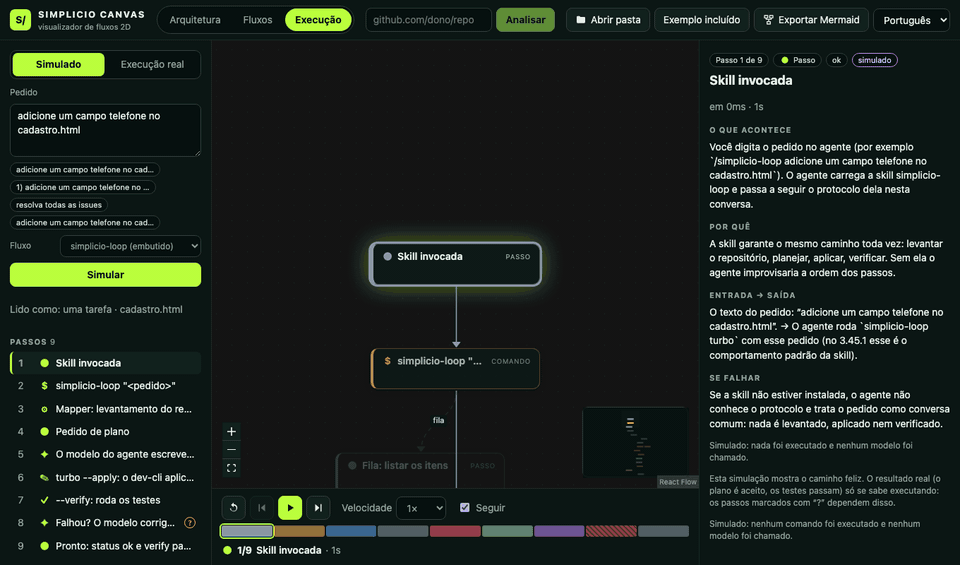
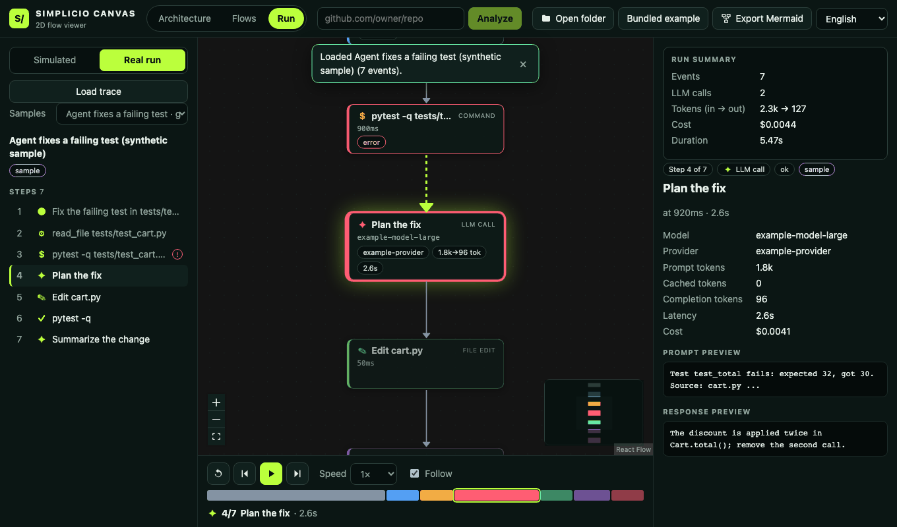
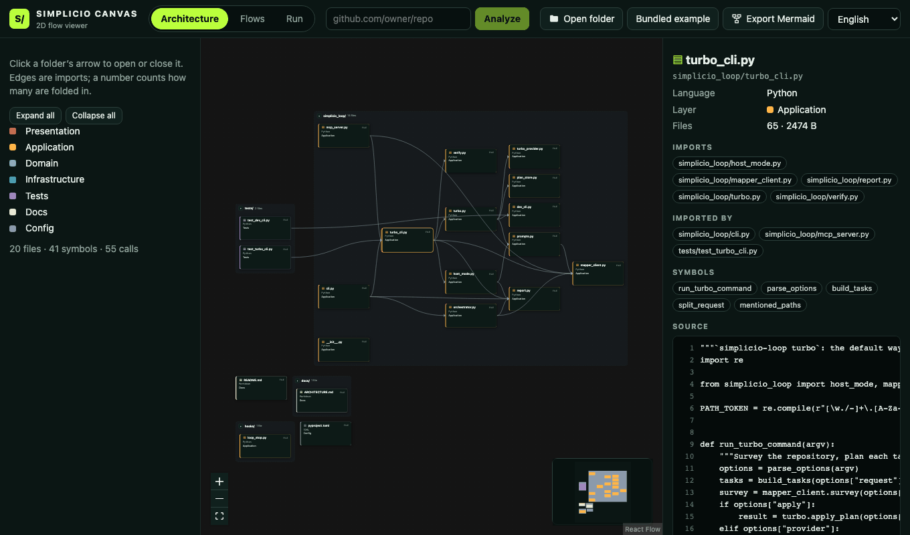

# Simplicio Canvas — see how software flows

<p align="center">
  <strong>English</strong> · <a href="docs/i18n/README.pt-BR.md">Português</a> · <a href="docs/i18n/README.es.md">Español</a> · <a href="docs/i18n/README.fr.md">Français</a> · <a href="docs/i18n/README.de.md">Deutsch</a> · <a href="docs/i18n/README.it.md">Italiano</a> · <a href="docs/i18n/README.nl.md">Nederlands</a> · <a href="docs/i18n/README.pl.md">Polski</a> · <a href="docs/i18n/README.ru.md">Русский</a> · <a href="docs/i18n/README.uk.md">Українська</a> · <a href="docs/i18n/README.tr.md">Türkçe</a> · <a href="docs/i18n/README.ar.md">العربية</a> · <a href="docs/i18n/README.hi.md">हिन्दी</a> · <a href="docs/i18n/README.ja.md">日本語</a> · <a href="docs/i18n/README.ko.md">한국어</a> · <a href="docs/i18n/README.zh-CN.md">简体中文</a>
</p>

<p align="center">
  
</p>

<p align="center">
  <a href="https://github.com/simpletibr/simplicio-canvas/blob/main/LICENSE"></a>
  
  
</p>

**Paste a GitHub project link and see its flows as 2D flowcharts. Replay what really happened when someone asked a tool for something — every step, every LLM call — or simulate it without running anything.** Think *dynamic Mermaid*.

## What you get

| | |
|---|---|
| **Flows** | The architecture (folders, imports) and one flow per entry point — console scripts, CLI commands, MCP tools, `main` functions, or any function you pick — from the `simplicio-mapper` call graph and symbol index: entry → steps → calls, with what each step does (docstring), signature, callers, callees and source. Depth-limited, expandable node by node. |
| **Replay** | A step-by-step player (play, pause, step, speed, timeline) for a real run: the JSON that `simplicio-loop turbo` prints, or any [`simplicio.trace/v1`](docs/trace-format.md) JSONL file from your own script, MCP server or LLM app. Every LLM call shows model, provider, tokens, cost, latency and prompt/response preview. |
| **Simulation** | Type a request ("add a phone field to signup.html", "resolve all issues") and watch where it would go and why, with a plain-language explanation for every step — no model call, no key. Built in for the `simplicio-loop` flow; for any project it walks the call graph from the entry point you choose. See [docs/simulation.md](docs/simulation.md). |
| **Mermaid export** | The current view as flowchart text for docs, issues and pull requests. |

<p align="center">
  
</p>

<p align="center">
  
  
</p>

## Run it locally

```bash
git clone https://github.com/simpletibr/simplicio-canvas.git
cd simplicio-canvas
npm install
npm run dev          # http://127.0.0.1:5173
```

- **Paste a GitHub link** (`github.com/owner/repo`) in the top bar and press **Analyze**. The local Vite bridge makes a shallow clone under `.simplicio/workspaces`, runs `simplicio-mapper scan` and sends the source files and Mapper's artifacts to the page. It needs `git` and `simplicio-mapper` on your `PATH` (`python3 -m pip install simplicio-loop` provides it; `npm run bootstrap` prints a readiness receipt). Without Mapper you still get the architecture view.
- **Open folder** reads a directory in the browser (a `.simplicio-loop/` folder written by `simplicio-mapper scan` is picked up too).
- **Load a trace**: *Run → Real run → Load trace*, or drop the file on the page. It accepts `simplicio.trace/v1` JSONL and the JSON printed by `simplicio-loop turbo` (provider mode and host mode).
- **Simulate**: *Run → Simulated*, type a request, press **Simulate**.

The first screen opens a bundled, representative snapshot of the `simplicio-loop turbo` pipeline with real Mapper artifacts, and three sample replays.

## The trace format and other tools

`simplicio.trace/v1` is one JSON event per line — `{"id","parent","kind","name","start","end","status","attrs"}` with kinds `step`, `llm_call`, `tool`, `command`, `file_edit` and `verify`. [docs/trace-format.md](docs/trace-format.md) is the contract, with a ~25-line Python emitter, a recipe to capture LLM calls by wrapping the HTTP client, the mapping from `simplicio-loop turbo`, and the design of the next layer (an OpenAI-compatible proxy that records calls for any app).

> The bundled turbo replays are **samples built from the documented schema**, not captures: no `OPENROUTER_API_KEY` was available to run `simplicio-loop turbo` for real, and host mode (3.45.1) is not released yet. The doc says exactly which parts are real.

## Private by design

Everything runs in your browser. Files, traces and Mapper artifacts are never uploaded; the only network call the app makes is to the local import bridge, a test enforces that, and production builds ship a Content-Security-Policy that allows only their own origin. `npm run build:demo` builds the read-only demo: no import, only the bundled example, sample replays and files you pick locally.

## Why these libraries

| Choice | Why |
|---|---|
| **[@xyflow/react](https://reactflow.dev)** (React Flow) | The node-graph library LangFlow itself uses: pan, zoom, minimap, controls, custom nodes, accessibility, actively maintained. React comes with it. |
| **[@dagrejs/dagre](https://github.com/dagrejs/dagre)** | Small (its ESM build is under 50 kB), synchronous, deterministic hierarchical layout: easy to test, no worker. Folder groups are laid out bottom-up by our own small wrapper, which keeps "collapsed group = one node" a plain model question. ELK's bundle is 1.6 MB (470 kB gzipped), more than twice this whole page, for nested layout we do not need yet; Cytoscape.js would replace React Flow's node-as-a-React-component model that the cards and the player build on. |
| **[smol-toml](https://github.com/squirrelchat/smol-toml)** | Reads `[project.scripts]` correctly instead of a regex over TOML. |
| **Vite, Vitest, jsdom, Testing Library** | Already the project's toolchain (Vite, Vitest); jsdom and Testing Library render the real app in tests. |

## What was removed

The Three.js workspace, the VS-Code-like shell around it (activity bar, explorer, terminal, run/debug, source-control panel, command palette, onboarding, 15-locale string table) and the domain modules that only that UI used, with their tests. `three` is no longer a dependency. The old direction is in git history (`d680542`).

## Develop

```bash
npm test                  # unit, UI (jsdom), integration, system and benchmark tests
npm run test:coverage     # v8 coverage
npm run build             # tsc + vite build
npm run build:demo        # read-only demo build (dist-demo)
npm run fixtures          # regenerate derived fixtures (needs simplicio-mapper for the Mapper artifacts)
npm run benchmark:render  # performance budgets
```

Layout: `src/domain` (pure logic, no UI imports) · `src/ui` (React) · `src/simulation` (the editable explanation texts) · `server` (the local import bridge and the CSP) · `fixtures` · `docs`.

## Known limits and next layers

- **Mapper cuts its call graph at 1,000 edges** and resolves calls lexically; large projects show partial flows (the UI says so). A next layer can ask Mapper per entry point (`simplicio-mapper ask … callees`) and show its `flows` effects (`fs-write`, `network`, `subprocess`).
- **Live mode**: tail a growing trace file while a run is in progress.
- **`simplicio-loop --trace`**: emit `simplicio.trace/v1` natively, with real timestamps, per-call cost and previews (turbo-run/v1 carries none of them).
- **The proxy** for arbitrary LLM apps (documented in [docs/trace-format.md](docs/trace-format.md), not built).
- HTTP routes as entry points, syntax highlighting in the source excerpt, a bundle split for the 670 kB main chunk, more interface languages than pt-BR and English.
- Editing contracts from the earlier direction (`operations`, `change-plan`, `generators`, `apply-gate`, ...) are still in `src/domain` but nothing in the viewer uses them.

## License

[MIT](LICENSE)
