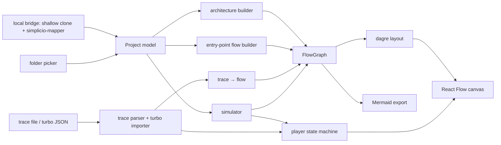

# Simplicio Canvas — product and architecture

> The earlier direction (3D "puzzle pieces", visual editing of code) is in git history at `d680542`. Canvas is now a simple,
> local-first **2D flow viewer**: this document is its current scope.

## Vision

A person pastes a GitHub project link and sees **how the software flows**: the architecture, and for each entry point a
flowchart of entry → steps → calls with what every step does and its source. The same canvas replays **what really
happened** when someone asked a tool (a script, a CLI, an MCP server, `simplicio-loop`) for something — step by step,
including every LLM call — and can **simulate** a request without running anything, explaining each step in plain
language. Think "dynamic Mermaid".

## Views

| View | Source | What it shows |
|---|---|---|
| Architecture | files, imports (Python resolved precisely, other languages from Mapper and the analyzer) | folders as collapsible groups, import edges, layer colours |
| Flows | Mapper `symbol-index` + `call-graph` | one flow per entry point (console script, CLI command, MCP tool, `main`, any function), depth-limited, expandable |
| Run → Real | a `simplicio.trace/v1` file, or the JSON of `simplicio-loop turbo` | the run as a flow plus a player; LLM calls with model, tokens, cost, latency, previews |
| Run → Simulated | a request + a flow | the steps the request would take, each with an explanation and `?` on what cannot be known |

Every view exports **Mermaid** flowchart text.

## Contracts

- **`simplicio.trace/v1`** ([trace-format.md](trace-format.md)): one JSON event per line; the only input the replay needs.
  Everything that wants to be visualised converts to it (`simplicio-loop turbo` documents do, in `src/domain/turbo.ts`).
- **Mapper artifacts** (`project-map`, `call-graph`, `symbol-index`): read defensively (`src/domain/mapper.ts`); a missing or
  truncated artifact degrades the view and says so, it never fabricates data.
- **FlowGraph** (`src/domain/flow-graph.ts`): the renderer-neutral graph every builder produces and the canvas, the
  Mermaid export and the simulator consume.

## Architecture

Rules: `src/domain` is pure TypeScript and never imports UI code; builders produce the graph, renderers consume it; the
simulator and importers never execute anything; nothing leaves the browser except the request to the local bridge.

## Non-functional requirements

- Local-first and private: no source, trace or artifact upload; production builds carry a CSP limited to their own origin.
- Interactive at project scale: 1,500 files / 4,500 symbols model in well under a second; overview layouts in milliseconds
  (see `tests/render-benchmark.test.ts`).
- Keyboard-reachable canvas and controls, a polite live region for the current replay step, reduced-motion support, and
  non-colour cues (kind labels, "?" and dashed borders for unknown steps).
- Interface languages: Portuguese (Brazil) and English.

## Out of scope for now

Editing or generating code from the canvas, real-time collaboration, cloud indexing, running commands or models, HTTP
routes as entry points, live tailing of traces (a next layer), and the proxy that records LLM calls for arbitrary apps.
