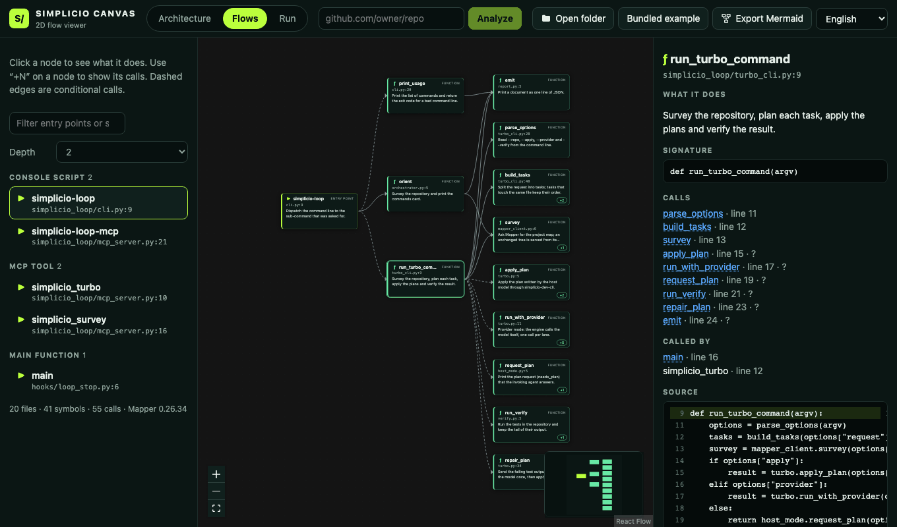

# Simplicio Canvas

[← English](../../README.md) · **Українська**

Локальний 2D-переглядач потоків. Вставте посилання на проєкт GitHub, щоб побачити його потоки у вигляді блок-схем (точка входу → кроки → виклики, з описом того, що робить кожен крок, і його кодом), а потім відтворіть реальний або змодельований запуск крок за кроком, включно з кожним викликом LLM.

```bash
git clone https://github.com/simpletibr/simplicio-canvas.git
cd simplicio-canvas && npm install && npm run dev
```

Запуск локально: `npm run dev` → http://127.0.0.1:5173

- **Потоки** — архітектура й один потік на точку входу, з експортом у Mermaid.
- **Відтворення** — завантажте файл `simplicio.trace/v1` або JSON, який друкує `simplicio-loop turbo`; відтворення, пауза, покроковий режим; кожен виклик LLM із моделлю, токенами, вартістю, затримкою та превʼю промпту й відповіді.
- **Симуляція** — введіть запит і подивіться, куди він піде і чому, нічого не запускаючи.

Код лишається у вас: файли читаються в браузері й ніколи не завантажуються.



[Формат трасування](../trace-format.md) · [Симуляція](../simulation.md) · [MIT](../../LICENSE)
